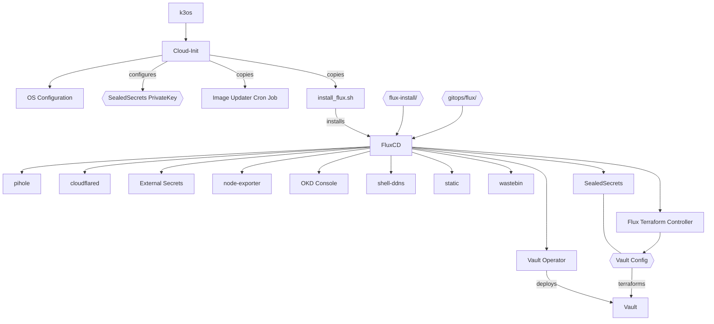

# Voodoo Board

This repoitory sets up and configures the voodoo board. A SBC running various small services on K3os.

## Installation

K3os is installed via a cloudinit(-ish?) configuration file. [See k3os docs](https://github.com/rancher/k3os/blob/master/README.md#configuration). The full configuration file is generated via a Makefile.

To complete the Setup, boot the k3os-amd64.iso as Live-System (e.g. via PiKVM). Copy the generated `config.yaml` to the system and run `sudo k3os install`

```bash
# Generate cloud-init config in out/config.yaml
make

# Because the config.yaml is too big for the text-paste system of PiKVM, you can host it on a HTTP server
firewall-cmd --add-port 8000/tcp
python -m http.server

# On K3os run (login rancher + ssh-key)
sudo k3os install

http://10.0.0.11:8000/config.yaml
```

## K3os Config

Input files for K3os config.yaml
* `./password.txt` Add the password for the 'rancher'-user here
* `./id_rsa.pub` Add an SSH key to login with the rancher user remotely
* `./sealed.key` and `./sealed.crt` Sealed Secrets private Key
* `k3os/network.config`: Network config
* `k3os/install_flux.sh` Download flus installation files from this repo and copy them into k3s automatic deployment directory /var/lib/rancher/k3s/server/manifests

## Architecture


All applcations are handled by fluxcd

### Secrets Management
Secrets are handled via a combination of vault and SealedSecrets.

* The plain secrets are stored in `secrets/<app-dir>/<secret>.yaml`. This path os obviously not pushed to git
* The Makefile encrypts the secrets using `kubeseal` and stores them in `gitops/<app-dir>/<secret>-sealed.yaml`
* Banzaicloud Vault Operator stores the decrypted Secrets in Vault
* The External-Secrets-Otperator fetches the Secrets from vault and creates the actual Secret

```bash
# to update Secrets run
make kubeseal
```

