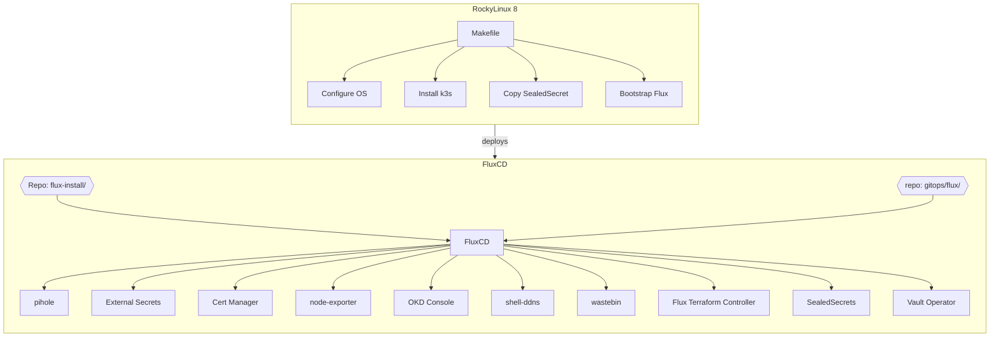
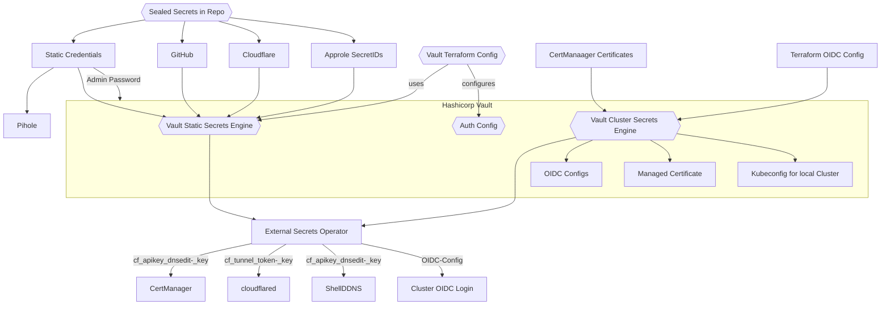

# Cluster: evergreen

This repoitory managed the evergreen-cluster, a single-node Kubernetes cluster providing infrastructure services to the rest of the Network.

## Installation

First Install RockyLinux 8 and setup passwordless SSH access to the server.

```bash
# Generate the SealedSecret encryption secret
make

# Install and configure node
#
# ssh-install: installs k3s and a few OS packages
# ssh-kubeconfig: fetch the admin kubeconfig
# ssh-configure: bootstrap flux
make install
```

### Switch branches
To switch to a different branch, log into the server and run `~/bin/install_flux.sh <BRANCH>`

## Architecture
All applcations are handled by fluxcd
linux--installs-->fluxchart



## Secrets Management
Secrets are handled via a combination of vault and SealedSecrets.

* The plain secrets are stored in `secrets/<app-dir>/<secret>.yaml`. This path os obviously not pushed to git
* The Makefile encrypts the secrets using `kubeseal` and stores them in `gitops/<app-dir>/<secret>-sealed.yaml`
* Banzaicloud Vault Operator stores the decrypted Secrets in Vault
* The External-Secrets-Operator fetches the Secrets from vault and creates the actual Secret

```bash
# Rotate encryption key
mv sealed.crt sealed.crt.old
openssl req -new -x509 -nodes -days 30 -key sealed.key -out sealed.crt -subj "/CN=sealed-secret/O=sealed-secret"

# to update Secrets run
make kubeseal
```
### Secret Flow




