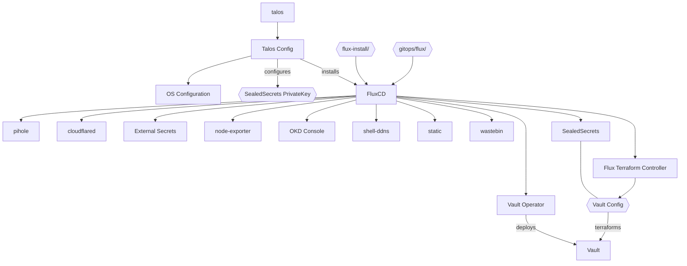
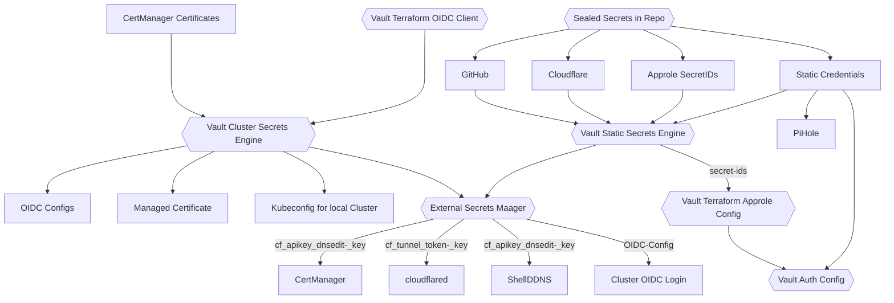

# Voodoo Board

This repoitory sets up and configures the voodoo board. A SBC running various small services on Talos.

## Installation

To install Talos, you first need to boot the `talos-amd64.iso` on your node. Then you apply the talos configuration to the node.

```bash
# Generate a OpenSSL keypair for sealed-secrets
# openssl ...

# Set NODE_IP and DHCP_IP in the Makefile
make talos-config

# Now boot the Node into the talos.iso
make talos-apply

# Wait for the initial Bootstrap to be complete
make talos bootstrap

```


## Architecture


All applcations are handled by fluxcd

### Secrets Management
Secrets are handled via a combination of vault and SealedSecrets.

* The plain secrets are stored in `secrets/<app-dir>/<secret>.yaml`. This path is obviously not checked in.
* The Makefile encrypts the secrets using `kubeseal` and stores them in `gitops/<app-dir>/<secret>-sealed.yaml`
* Banzaicloud Vault Operator stores the decrypted Secrets in Vault
* The External-Secrets-Otperator fetches the Secrets from vault and creates the actual Secret

```bash
# Rotate encryption key
openssl req -new -x509 -nodes -days 30 -key sealed.key -out sealed2.crt -subj "/CN=sealed-secret/O=sealed-secret"

# to update Secrets run
make kubeseal
```
#### Secret Flow


